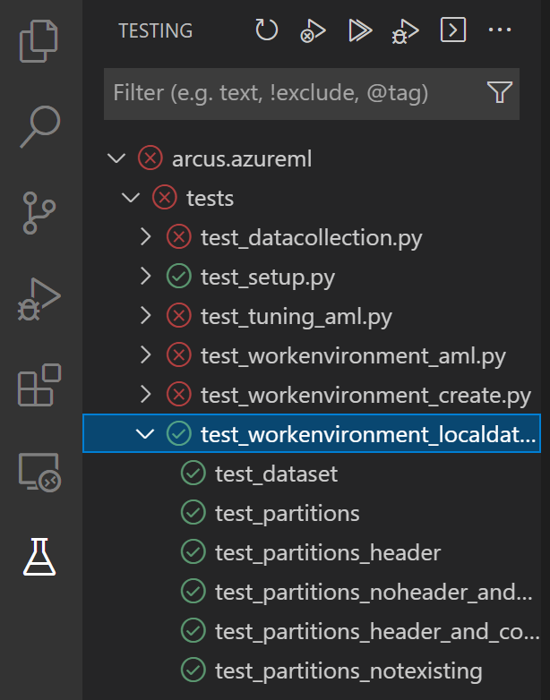
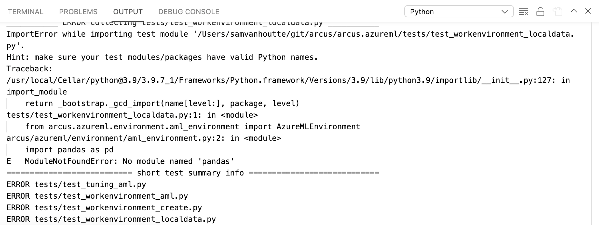

# Arcus - Azure Azure Machine Learning
[](https://dev.azure.com/codit/Arcus/_build/latest?definitionId=836&repoName=arcus-azure%2Farcus.ml&branchName=master)
[](https://badge.fury.io/py/arcus-azureml)

Azure Machine Learning development in a breeze.


# Positioning

With Arcus we are offering an open source library that streamlines Azure ML development, but lets ML engineers focus on the actual job at hand, without loosing time in tinkering with the AzureML SDK and all overhead that comes with it.

We offer the following concepts:

- Connectivity to an Azure ML workspace
- Start experiments on your local development environment (from within Jupyter notebooks or in plain .py scripts)
- Automatically track every run in an experiment on the Azure ML workspace (even if you execute everything locally).  This way you get a perfect overview of all training attempts, the actual parameters, the results and the persisted models
- Provide tracking & tracing of Grid Searches for Hyper parameter tuning
- Enable trainings (through standard scripts and dependency files) to be executed locally and in the cloud, using the exact same logic and code.

# Documentation
All documentation can be found on [here](https://azure-ml.arcus-azure.net/).

# Installation

The Arcus packages are available through PyPi and can be installed through pip, by executing the following command:

```shell
PM > pip3 install arcus-azureml
```

Upgrading to the latest version can be done by executing the following pip command:

```shell
PM > pip3 install --upgrade arcus-azureml 
```

Every CI build pushes a dev package to the PyPi feed.  And when committed, an alpha release is been published on the same feed.  These packages can be installed or upgrade, by leveraging the `--pre` argument for `pip`.

```shell
PM > pip3 install --upgrade --pre arcus-azureml
```

# Local development

The following steps show you how you can get started with local development for the Arcus Python packages.  These steps have been tested and verified on a Windows 10 development environment, but the same steps should be applied in case of developing on MacOS or Linux.

## Installation guide

The steps below are based on the [official documentation of Microsoft](https://docs.microsoft.com/en-us/windows/python/web-frameworks).  
There are many ways to configure a local environment with a Python setup for development.  Here we are describing the way to use Python on Windows, using the Windows Subsystem for Linux and Visual Studio code. 
It is also perfectly possible to install your Python straight onto your development machine and connect your favourite editor there.            

### Install Windows Subsystem for Linux

Follow the steps, outlined in [this document](https://docs.microsoft.com/en-us/windows/wsl/install).

- Enable the Windows Feature for WSL (if not done yet)
- Run `wsl --install -d Ubuntu` in the command prompt
- Configure your user and password for your Linux Distribution and update that distribution, using `sudo apt update && sudo apt upgrade`
- Install Windows Terminal
- Following any (optional) extra instructions in the WSL development [environment documentation](https://docs.microsoft.com/en-us/windows/wsl/setup/environment#set-up-your-linux-username-and-password).

### Install and verify required Python prerequisites

- Verify python is installed in your Linux distribution by running `python3 --version`.  This guide has been tested with **Python 3.8.10**.
- Install **pip**, which is the Python Package installer.  Execute `sudo apt install python3-pip`.
- Install **venv**, which supports to create Virtual Python Environments (and isolate dependencies from each other).  Execute `sudo apt install python3-venv`.
- When running `deactivate`, you deactive the virtual environment.

### Create your Arcus python environment

- Get the correct code from Github, by performing a `git clone` into your WSL.
- Install all required dependencies for your arcus project, by executing the following in your WSL prompt: `pip3 install -r requirements.txt`.  This takes all packages that are configured in the requirements.txt file and installs them in your virtual environment.
- Execute the following in the WSL shell: `python3 -m venv .venv`.  This creates a new virtual Python environment, in a directory named **.venv**.  This can be done for every Python project you develop.  
- Activate and start your .arcus environment by running `source .venv/bin/activate`. 
- Exclude `.venv` from your `.gitignore`, if not done yet. 

### Configure Visual Studio Code

In order to get started developing locally, we recommend [Visual Studio Code](https://code.visualstudio.com/) as the main tool for development.  If you are new to this, we recommend reading this [overview and getting started guide](https://code.visualstudio.com/docs/python/python-tutorial).

The following VSCode extensions are recommended:

- **Remote - WSL Extension**: use Windows Subsystem for Linux as your integrated development environment. ([Install](https://marketplace.visualstudio.com/items?itemName=ms-vscode-remote.remote-wsl))
- **Python (Microsoft)**: Intellisense, Test Explorer, Linting & Debugging. ([Install](https://marketplace.visualstudio.com/items?itemName=ms-python.python))

### Open Arcus in Visual Studio Code

- Execute the `Remote-WSL: Open Folder in WSL...` command in VSCode. 
- Navigate to `/home/<user>` and your correct arcus folder in the WSL folder selection.

The following general Python packages are recommended to install (these are not needed in the requirements.txt file, as they are for the development environment only).

That can be done by executing the following lines in your WSL terminal:

```bash
pip3 install <package-name>
```

- **pytest**: for the unit tests
- **jupyter-notebook**: for the jupyter notebooks to run

### Run unit tests

The VSCode Test Explorer should normally discover and show all unit tests that are part of the solution.  You can easily run those tests as a validation.



In case unit tests are not discovered, the error will be shown in the Output window, when selecting 'Python' in the dropdown.



## Local reference installation

It can be quite common that you are using the arcus-ml or arcus-azureml packages on other projects and you need some changes or additional functionality being added to the package.  Obviously, it's possible to follow the entire release pipeline (make a PR, get it approved and merged, wait for package to appear on the PyPi feed and upgrade the package).  This workflow is too tedious and will not increase your productivity.

The approach to go, is to leverage the following command, which will add a symbolic link to your development directory from the python packages.  That way, you always refer to the latest code that is on your development environment.  It is advised, though not required to leverage virtual environment (like with conda) for this.

```shell
pip install -e /path-to-arcus
```

# Customers
Are you an Arcus user? Let us know and [get listed](https://bit.ly/become-a-listed-arcus-user)!

# License Information
This is licensed under The MIT License (MIT). Which means that you can use, copy, modify, merge, publish, distribute, sublicense, and/or sell copies of the web application. But you always need to state that Codit is the original author of this web application.
